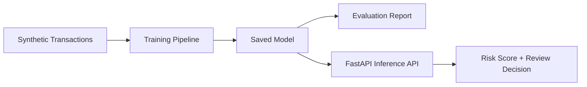

# Fraud Detection Model

Early ML project upgraded into a reproducible fraud-detection scaffold with training, evaluation, API inference, tests, and honest limitations.

## Live Demo

- Demo URL: `Not deployed yet`
- Local API docs: `http://localhost:8000/docs`

## Problem

Fraud detection is a high-imbalance classification problem. The goal is to identify suspicious transactions while keeping false positives manageable enough for human review teams.

This repository is positioned as an early portfolio project and a clean foundation for future work, not as a production fraud system trained on real financial data.

## Features

- Production-style folder structure.
- Synthetic imbalanced transaction dataset generator for reproducible demos.
- Scikit-learn training pipeline.
- Evaluation script with precision, recall, F1, ROC-AUC, and confusion matrix.
- FastAPI inference endpoint.
- Tests for data generation, training, and prediction.
- Model card, deployment notes, `.env.example`, `.gitignore`, and LICENSE.
- Original notebook preserved under `notebooks/` for learning history.

## Architecture



## Tech Stack

| Layer | Tools |
| --- | --- |
| ML | scikit-learn, pandas, NumPy, joblib |
| API | FastAPI, Pydantic, Uvicorn |
| Testing | Pytest |
| Deployment | Docker-ready path planned; Render/Railway suitable |

## Project Structure

```text
fraud-detection-model/
├── app/
│   └── api.py
├── notebooks/
│   └── fraud_detection_model.ipynb
├── scripts/
│   ├── train.py
│   └── evaluate.py
├── src/
│   ├── data.py
│   ├── model.py
│   └── settings.py
├── tests/
│   └── test_pipeline.py
├── MODEL_CARD.md
├── DEPLOYMENT.md
└── requirements.txt
```

## Setup

```bash
python -m venv .venv
source .venv/bin/activate
pip install -r requirements.txt
cp .env.example .env
```

## Environment Variables

| Variable | Purpose |
| --- | --- |
| `MODEL_PATH` | Saved model artifact path |
| `REPORT_PATH` | Evaluation report output path |
| `FRAUD_THRESHOLD` | Probability threshold for review decisions |
| `RANDOM_STATE` | Reproducibility seed |

## Train

```bash
python scripts/train.py
```

## Evaluate

```bash
python scripts/evaluate.py
```

## Run API

```bash
uvicorn app.api:app --reload
```

Predict:

```bash
curl -X POST http://localhost:8000/predict \
  -H "Content-Type: application/json" \
  -d '{"amount":1299.0,"hour":2,"merchant_risk":0.8,"customer_age_days":12,"transactions_last_24h":9,"is_foreign":true}'
```

## ML Approach

The current pipeline uses synthetic tabular data with class imbalance. It trains a preprocessing and Logistic Regression pipeline so the repo remains lightweight and reproducible.

For a stronger future version, replace synthetic data with a public fraud dataset, add realistic feature engineering, and compare models such as Random Forest, XGBoost/LightGBM, and calibrated classifiers.

## Evaluation

The evaluation script reports precision, recall, F1 score, ROC-AUC, and confusion matrix.

For fraud detection, recall is important because missed fraud is costly, but precision must also be monitored to avoid overwhelming review teams.

## Deployment

Do not deploy this as a portfolio flagship yet. It is now clean enough to keep public as an early ML project, but it should be deprioritized behind the RAG and NLP systems.

See `DEPLOYMENT.md` for the deployment path once a stronger dataset/model is added.

## Roadmap

- Add a real public fraud dataset with clear citation.
- Add model comparison and threshold tuning.
- Add SHAP or feature-importance explanations.
- Add Dockerfile after the model path is stable.
- Deploy a small demo API only after evaluation is meaningful.

## Author

Yash Sharma - MCA AI/ML student focused on ML systems, NLP, RAG, GenAI, and backend AI services.
